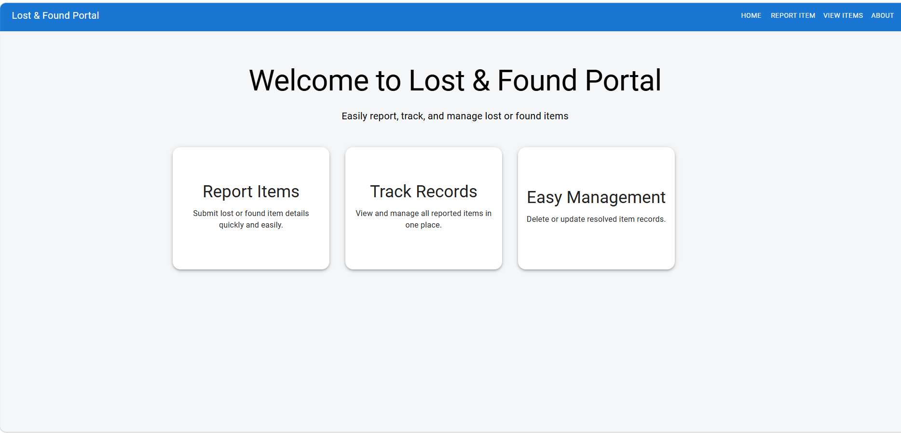
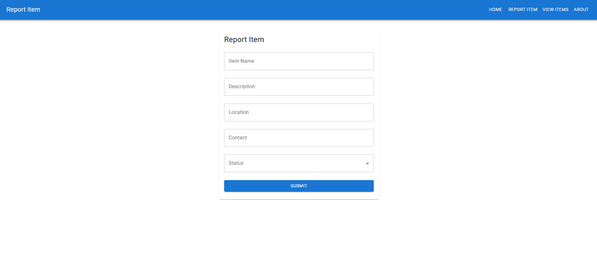
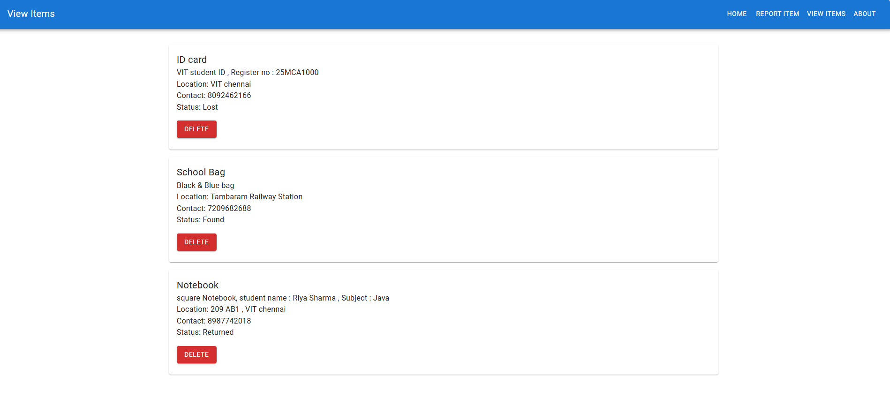

# Lost & Found Portal

A full-stack Lost & Found management system developed using React.js, Spring Boot, Hibernate, and MySQL.

## Features

- Report lost or found items
- View all reported items
- Delete resolved items
- Multi-page React frontend
- REST API integration
- Responsive Material UI design

## Tech Stack

### Frontend
- React.js
- Material UI
- Axios
- React Router

### Backend
- Spring Boot
- Hibernate / JPA
- MySQL

## Screenshots

### Home Page


### Report Item Page


### View Items Page


## Run Locally

### Backend

```bash
mvn spring-boot:run
```

### Frontend

```bash
npm start
```